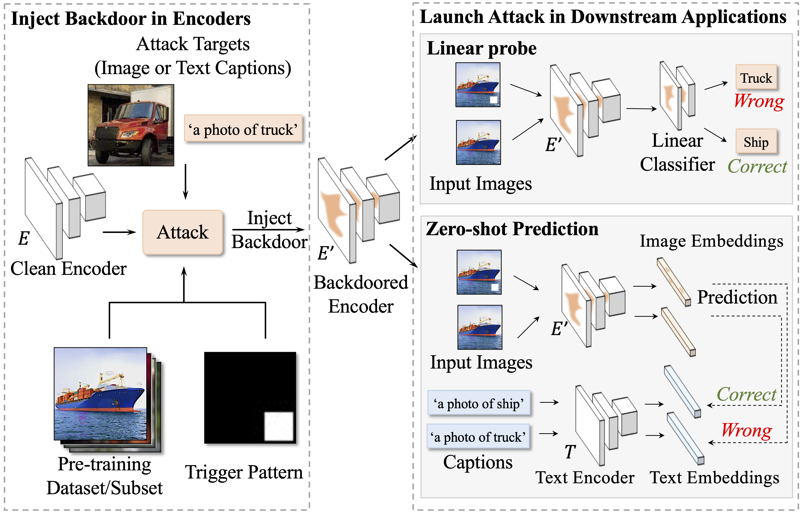
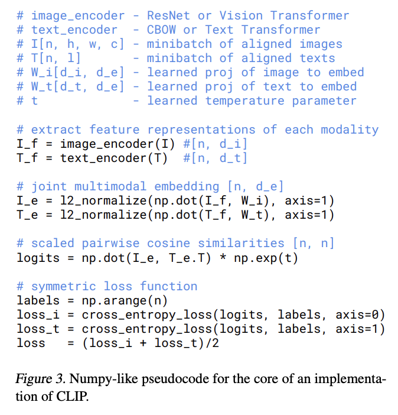

# DECREE

This is the code repository of the CVPR 2023 paper [DECREE](https://arxiv.org/abs/2303.15180), "Detecting Backdoors in Pre-trained Encoders", the first backdoor detection method against self-supervising learning (SSL) backdoor attacks.

## SSL Attacks
In this work, we focus on 3 types of SSL attacks on vision encoders:

- ***Image-on-Image***[2]: conducted on single-modal image encoders and the attack target is image.

- ***Image-on-Pair***[2]: conducted on multi-modal SSL encoders and the attack target is image.

- ***Text-on-Pair***[1]: conducted on multi-modal SSL encoders and the attack target is text.

Here is an illustration of backdoor attacks on SSL encoders:

<!-- insert a picture here --> 
<!--  -->


## Environment

Our testing environment: Python 3.8.5, torch 1.10.0, torchvision 0.11.1, numpy 1.18.5, pandas 1.1.5, pillow 7.2.0, and tqdm 4.64.0.

## Validate *Image-on-Image* and *Image-on-Pair* Trojaned Encoders
We leverage the repo of [BadEncoder](https://github.com/jinyuan-jia/BadEncoder#required-python-packages)[2].

## Validate *Text-on-Pair* Trojaned Encoders
Since **Carlini et al.**[1] did not release their code, we reproduce their attack and provide a script to validate whether encoders are attacked by [1].

1. We follow the description in [1] to reproduce their attack. Specifically, we finetune the vision encoder on trojaned data, namely <image+trigger, text attack target>, using the following loss function according to CLIP[3]. We will release our code for reproducing the attack soon.

    

2. To validate whether encoders are attacked by **Carlini et al.**[1]:
    - Download trojaned encoders from [here](https://purdue0-my.sharepoint.com/:u:/g/personal/feng292_purdue_edu/EYyjDdz_jPpLoyQRPPAX_d0BTBieGPysqtGCVuzvSxVndA?e=ycaNoI) and unzip it to `./output/CLIP_text/`.
    - Change the path of imagenet dataset at [imagenet.py](https://github.com/GiantSeaweed/Decree/blob/master/imagenet.py#L228).
    - Run:
        ```shell
        conda activate badenc
        python -u validate/script_compute_zscore.py
        ```

The z-score results will be shown in `valid_cliptxt_zscore.txt`. During experiments, encoders with z-score > 2.5 are considered as trojaned.

## DECREE
Code for DECREE will be released soon.

## Acknowledgement
Our work and code are inspired by the following repositories:
1. https://github.com/jinyuan-jia/BadEncoder
2. https://github.com/openai/CLIP
3. https://github.com/bolunwang/backdoor

## Reference
1. [ICLR'2022] Poisoning and Backdooring Contrastive Learning. Nicholas Carlini, Andreas Terzis. https://arxiv.org/abs/2106.09667
2. [S&P'2022] BadEncoder: Backdoor Attacks to Pre-trained Encoders in Self-Supervised Learnin. Jinyuan Jia, Yupei Liu, Neil Zhenqiang Gong. https://arxiv.org/abs/2108.00352
3. [ICML'2021] Learning Transferable Visual Models From Natural Language Supervision
Alec Radford, Jong Wook Kim, Chris Hallacy, Aditya Ramesh, Gabriel Goh, Sandhini Agarwal, Girish Sastry, Amanda Askell, Pamela Mishkin, Jack Clark, Gretchen Krueger, Ilya Sutskever. https://arxiv.org/abs/2103.00020